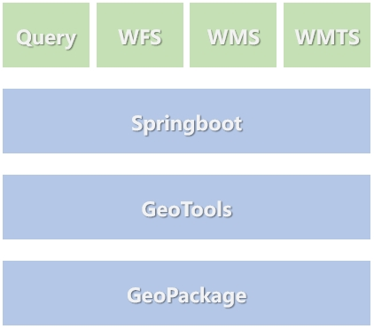

# Introduction
The supporting code for "Core Technologies of Spatio-temporal Big Data System". Each module in the project corresponds to the chapters in the book. The purpose of this code repository is to help readers apply these algorithms more quickly. Therefore, we do not delve too much into the details of the algorithms, but rather focus on presenting their most commonly used usage methods. All the algorithms mentioned in the article provide executable classes containing the Main method. Users can view the Java toolkits contained in the execution classes and the usage methods.

## Reading Guide
### Chapter 4: Data Storage and Indexing (chapter-4-st-storage)
+ 4.1、Spatial data model
  + 4.1.1、Spatial data model [[code link]](chapter-4-st-storage/src/main/java/com/chronomon/storage/model/GeometryDataType.java)
  + 4.1.2、Spatial data characteristics [[code link]](chapter-4-st-storage/src/main/java/com/chronomon/storage/model/GeometryValidation.java)
  + 4.1.3、Spatial topological relationship [[code link]](chapter-4-st-storage/src/main/java/com/chronomon/storage/model/GeometryTopologyRelation.java)
+ 4.2、Spatio-temporal indexing algorithms
  + 4.2.2、Spatial indexing based on tree structure
    + KdTreeIndex [[code link]](chapter-4-st-storage/src/main/java/com/chronomon/storage/index/tree/KdTreeIndex.java)
    + QuadTreeIndex [[code link]](chapter-4-st-storage/src/main/java/com/chronomon/storage/index/tree/QuadTreeIndex.java)
    + RTreeIndex [[code link]](chapter-4-st-storage/src/main/java/com/chronomon/storage/index/tree/RTreeIndex.java)
  + 4.2.3、Spatio-temporal indexing based on filling curve
    + Z curve [[code link]](chapter-4-st-storage/src/main/java/com/chronomon/storage/index/curve/ZOrderIndex.java)
    + GeoHash encode [[code link]](chapter-4-st-storage/src/main/java/com/chronomon/storage/index/curve/GeoHash.java)
    + XZ curve [[code link]](chapter-4-st-storage/src/main/java/com/chronomon/storage/index/curve/XZOrderIndex.java)

### Chapter 5: Data Analysis and Mining (chapter-5-st-analysis)
+ 5.2、Geometric analysis
  + 5.2.1、Convex hull calculation [[code link]](chapter-5-st-analysis/src/main/java/com/chronomon/analysis/convex/ConvexHull.java)
+ 5.3、Spatial clustering
  + 5.3.1、KMeans [[code link]](chapter-5-st-analysis/src/main/java/com/chronomon/analysis/cluster/KMeansPlusPlusCluster.java)
  + 5.3.2、DBSCAN [[code link]](chapter-5-st-analysis/src/main/java/com/chronomon/analysis/cluster/DBSCANCluster.java)
+ 5.4、Trajectory analysis
  + 5.4.1、Trajectory preprocessing
    + Trajectory denoising [[code link]](chapter-5-st-analysis/src/main/java/com/chronomon/analysis/trajectory/filter/TrajNoiseFilter.java)
    + Stay point detection [[code link]](chapter-5-st-analysis/src/main/java/com/chronomon/analysis/trajectory/staypoint/TrajStayPointDetector.java)
    + Trajectory segmentation [[code link]](chapter-5-st-analysis/src/main/java/com/chronomon/analysis/trajectory/segment/TrajSegmenter.java)
    + Map matching [[code link]](chapter-5-st-analysis/src/main/java/com/chronomon/analysis/trajectory/mapmatch/HmmMapMatcher.java)
  + 5.4.2、Trajectory mining
    + Trajectory compression [[code link]](chapter-5-st-analysis/src/main/java/com/chronomon/analysis/trajectory/compress/TrajectoryCompress.java)
    + Trajectory similarity [[code link]](chapter-5-st-analysis/src/main/java/com/chronomon/analysis/trajectory/similarity/TrajectorySimilarity.java)
    + Trajectory clustering [[code link]](chapter-5-st-analysis/src/main/java/com/chronomon/analysis/trajectory/cluster/TrajectoryCluster.java)
    + Spatio-temporal co-occurrence [[code link]](chapter-5-st-analysis/src/main/java/com/chronomon/analysis/trajectory/cooccur/SocialStrengthInfer.java)
  + 5.4.3、Real-time trajectory analysis
    + Real-time GPS point sorting [[code link]](chapter-5-st-analysis/src/main/java/com/chronomon/analysis/trajectory/flink/GpsStreamSortFunction.java)
    + Real-time vehicle driving state detection [[code link]](chapter-5-st-analysis/src/main/java/com/chronomon/analysis/trajectory/flink/TrajStayPointDetectFunction.java)
    + Real-time trajectory map matching [[code link]](chapter-5-st-analysis/src/main/java/com/chronomon/analysis/trajectory/flink/TrajMapMatchFunction.java)
+ 5.5、Path planning
  + 5.5.1、DFS and BFS
    + Depth-first search DFS [[code link]](chapter-5-st-analysis/src/main/java/com/chronomon/analysis/path/DFSModel.java)
    + Breadth-first search BFS [[code link]](chapter-5-st-analysis/src/main/java/com/chronomon/analysis/path/BFSModel.java)
  + 5.5.2、Dijkstra algorithm [[code link]](chapter-5-st-analysis/src/main/java/com/chronomon/analysis/path/DijkstraModel.java)
  + 5.5.3、GBFS algorithm [[code link]](chapter-5-st-analysis/src/main/java/com/chronomon/analysis/path/GBFSModel.java)
  + 5.5.4、A* algorithm [[code link]](chapter-5-st-analysis/src/main/java/com/chronomon/analysis/path/AStarModel.java)
+ 5.6、Address search
  + 5.6.1、geocoding
    + Sliding window matching algorithm based on geographical hierarchy tree [[code link]](chapter-5-st-analysis/src/main/java/com/chronomon/analysis/address/AddressSearch.java)
### Chapter 6: Data Service and Sharing (chapter-6-st-service)
**Description：**
The code in this section builds a simple Springboot project and simply implements the three types of interfaces mentioned in Chapter 6, WFS, WMS, and WMTS. There is also a class control query.
+ WFS
+ WMS
+ WMTS
+ Query
  + Query based on polygonal range
  + Query based on rectangular range
  + Surrounding query based on point and radius

The entire architecture is shown in the following figure. The service layer is based on Springboot, the data access layer is based on GeoTools, and GeoPackage is used for storage at the bottom layer.

### Chapter 7: Data Visualization (chapter-7-st-visualization)
+ 7.2、Spatio-temporal data visualization
  + 7.2.5、 Dynamic vector tile service[[code link]](chapter-7-st-visualization/src/main/java/com/chronomon/visualization/vector/controller/VectorTileController.java)

 
